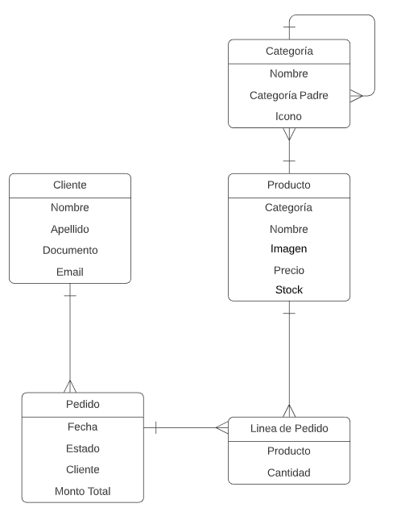

## Ecommerce Test

### Endpoints

- categories:
    - Retorna lista de categorías
    
- category-details:
    Detalles de la categoría
    - id: ID de la categoría a consultar
   
- add_to_cart:
    Agrega productos al carrito
    - order_id: Indica el pedido sobre el que trabajará el carrito. No se ingresa si es un nuevo carrito
    - product_id: ID del producto agregado al carrito
    - quantity: Cantidad a comprar

- cart:
    Muestra detalles del carrito
    - order_id: ID del pedido de referencia del carrito

- sale:
    Procesa el carrito, cambiando de estado a procesado.
    order_id: ID del pedido de referencia
    
## Diagrama Entidad-Relación

